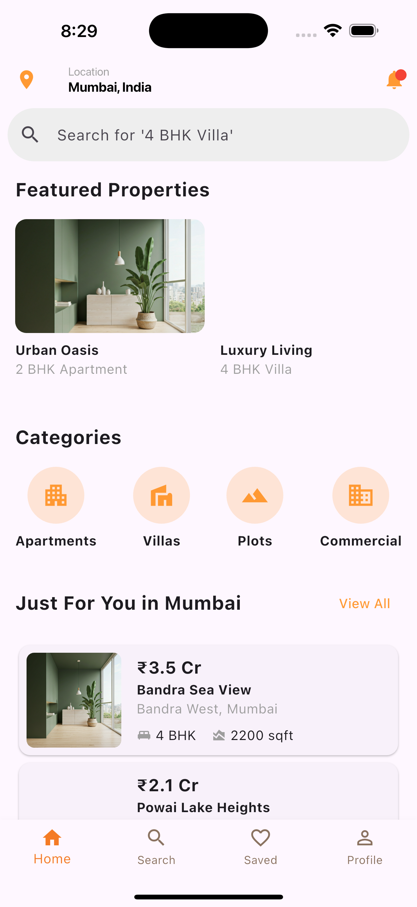
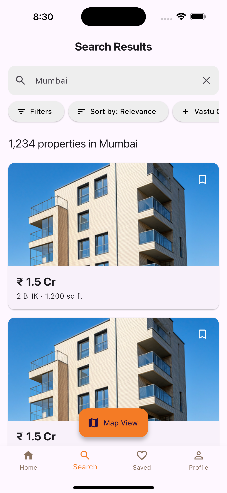
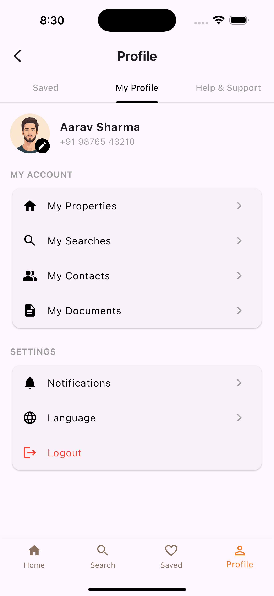
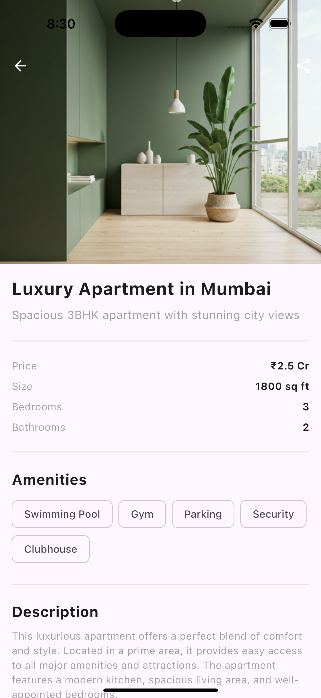

# UrbanNest

UrbanNest is a modern, user-friendly mobile application built with Flutter, designed to simplify the process of finding and managing rental properties. Whether you're a student, a young professional, or a family, UrbanNest helps you discover your next home with ease.

## 🚀 Features

*   **🏠 Onboarding:** A smooth and welcoming onboarding experience for new users.
*   **🔍 Property Search:** Easily search for rental properties with advanced filtering options.
*   **ℹ️ Property Details:** View comprehensive details for each property, including high-resolution images, amenities, and rent information.
*   **👤 User Profiles:** Create and manage your user profile and preferences.
*   **❤️ Saved Properties:** Save your favorite properties to view later.
*   **🧭 Bottom Navigation:** Intuitive navigation to effortlessly switch between different sections of the app.

## 📂 Project Structure

The project is structured as follows:

```
urbannest/
├── android/          # Android specific files
├── ios/              # iOS specific files
├── lib/
│   ├── main.dart     # Main entry point of the application
│   ├── screens/      # Contains all the screens of the application
│   └── widgets/      # Contains reusable widgets
├── test/             # Contains all the tests
└── pubspec.yaml      # Dependencies and project configuration
```

## 🏁 Getting Started

To get a local copy up and running, follow these simple steps.

### Prerequisites

*   Flutter SDK: [Installation Guide](https://flutter.dev/docs/get-started/install)
*   A code editor like VS Code or Android Studio.

### Installation

1.  Clone the repo
    ```sh
    git clone https://github.com/your_username/urbannest.git
    ```
2.  Navigate to the project directory
    ```sh
    cd urbannest
    ```
3.  Install dependencies
    ```sh
    flutter pub get
    ```
4.  Run the app
    ```sh
    flutter run
    ```

## 🤝 Contributing

Contributions are what make the open source community such an amazing place to learn, inspire, and create. Any contributions you make are **greatly appreciated**.

1.  Fork the Project
2.  Create your Feature Branch (`git checkout -b feature/AmazingFeature`)
3.  Commit your Changes (`git commit -m 'Add some AmazingFeature'`)
4.  Push to the Branch (`git push origin feature/AmazingFeature`)
5.  Open a Pull Request

## 📄 License

Distributed under the MIT License. See `LICENSE` for more information.

## 📸 Screenshots

| Onboarding | Search |
|---|---|
|  |  |

| Property Detail | Profile |
|---|---|
|  |  |

| Home |
|---|
|  |

